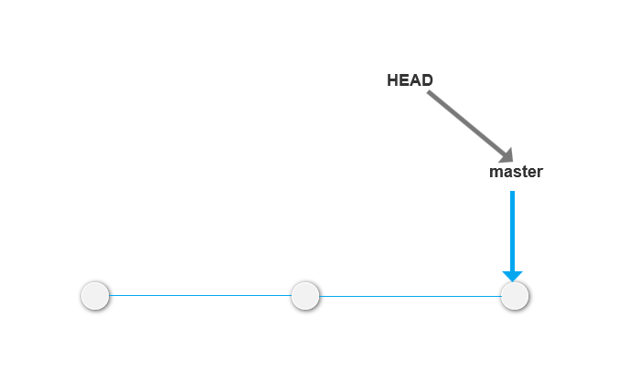
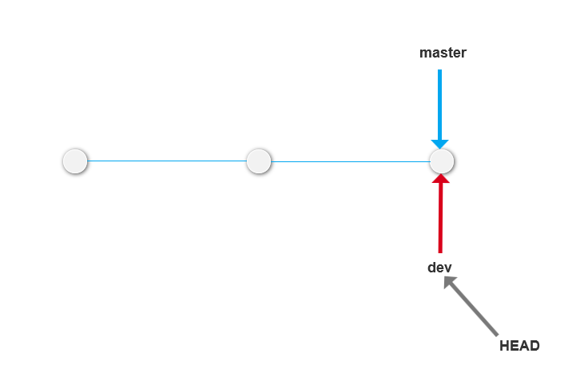
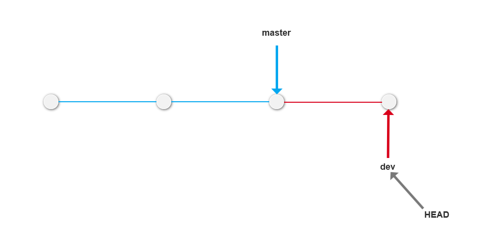
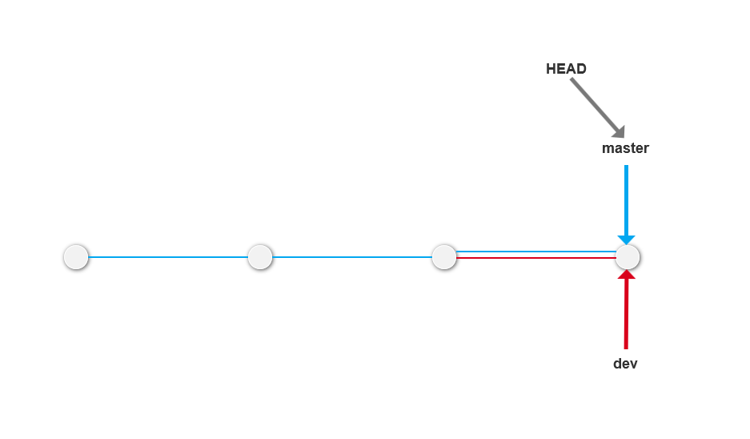
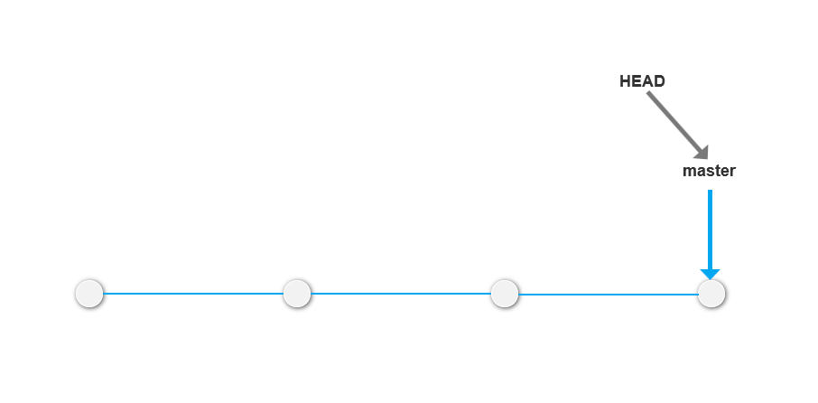
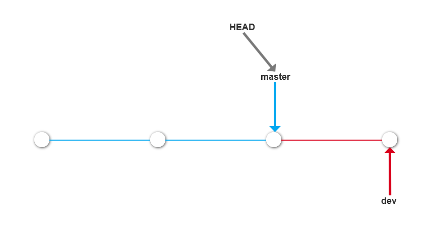
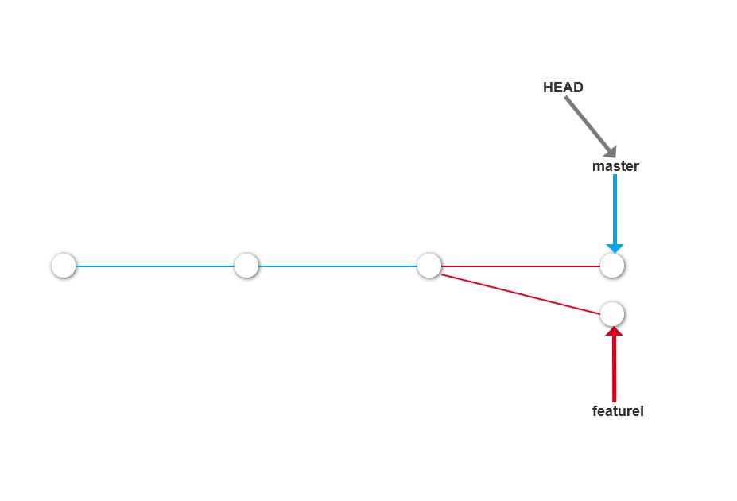
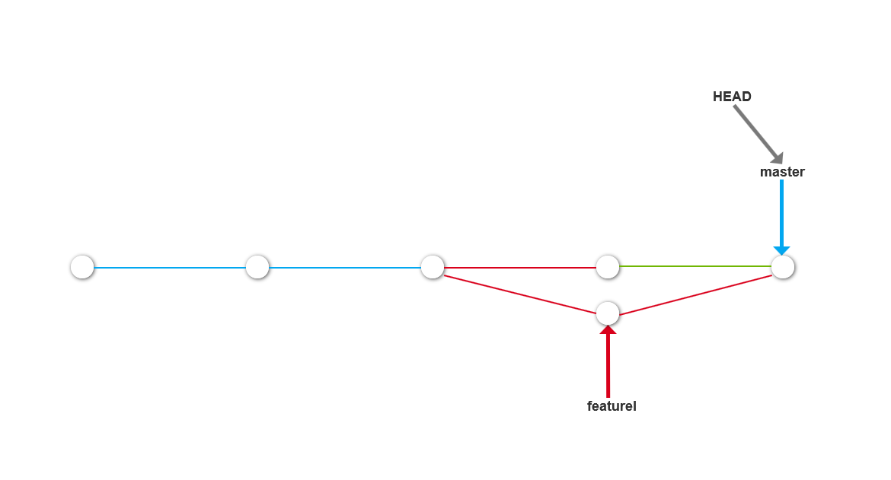
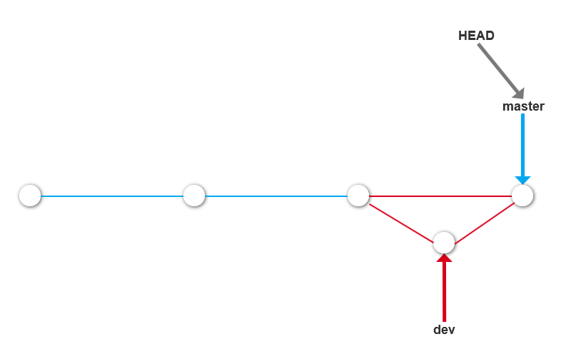

<!--ts-->
   * [Git 教程](#git-教程)
      * [Git 简介](#git-简介)
         * [创建版本库](#创建版本库)
            * [小结](#小结)
      * [时光穿梭机](#时光穿梭机)
         * [小结](#小结-1)
         * [版本回退](#版本回退)
            * [小结](#小结-2)
         * [工作区和暂存区](#工作区和暂存区)
         * [管理修改](#管理修改)
         * [撤销修改](#撤销修改)
            * [小结](#小结-3)
         * [删除文件](#删除文件)
            * [小结](#小结-4)
      * [远程仓库](#远程仓库)
         * [添加远程库](#添加远程库)
            * [SSH 警告](#ssh-警告)
            * [小结](#小结-5)
         * [从远程库克隆](#从远程库克隆)
            * [小结](#小结-6)
      * [分支管理](#分支管理)
         * [创建和合并分支](#创建和合并分支)
            * [switch](#switch)
            * [小结](#小结-7)
         * [解决冲突](#解决冲突)
            * [小结](#小结-8)
         * [分支管理策略](#分支管理策略)
            * [小结](#小结-9)
         * [Bug 分支](#bug-分支)
            * [小结](#小结-10)
         * [Feature 分支](#feature-分支)
            * [小结](#小结-11)
         * [多人协作](#多人协作)
            * [推送分支](#推送分支)
            * [抓取分支](#抓取分支)
            * [小结](#小结-12)

<!-- Added by: lion, at: 2019年 10月 12日 星期六 16:08:25 CST -->

<!--te-->

# Git 教程

## Git 简介

### 创建版本库

创建一个版本库，首先创建一个空目录

```code
$ mkdir git_learn
$ cd git_learn
$ pwd
/home/username/git_learn
```

`pwd` 命令用于显示当前目录

第二步，通过 `git init` 命令把这个目录变成 `Git` 可以管理的仓库

```code
$ git init
Initialized empty Git repository in /home/username/git_learn/.git/
```

可以发现目录下多了一个 `.git` 的目录，这个目录是 Git 来跟踪管理版本库的，尽量不要啊手动修改这个目录里面的文件，容易把 Git 仓库破坏。

如果没有看到 .git 目录，用 `ls -ah` 命令查看

编写一个 `readme.txt` 文件，内容如下

```code
Git is a version control system.
Git is free software.
```

一定要放到 `git_learn` 目录下（子目录也行），因为这是一个 Git 仓库，放到其他地方 Git 无法查找。  
将文件放到 Git 仓库步骤：  
第一步，用命令 `git add` 将文件添加到仓库：

```code
git add readme.txt
```

第二步，用命令 `git commit` 把文件提交到仓库：

```code
$ git commit -m "wrote a readme file"
[master (root-commit) ddc374f] wrote a readme file
 1 file changed, 2 insertions(+)
 create mode 100644 readme.txt
```

`git commit` 命令，`-m` 后面输入的是本次提交的说明，最好输入有意义的内容，这样从历史记录可以方便查找改动记录。  
`git commit` 命令执行成功后，会有内容说明  
比如上面的例子：  
`1 file changed`: 1 个文件被改动（新添加的 readme.txt 文件）
`2 insertions`: 插入了两行内容（readme.txt 有两行内容新增）

`commit` 可以一次提交多个文件，所以可以多次 `add` 不同的文件，比如：

```code
git add file1.txt
git add file2.txt file3.txt
git commit -m "add 3 files."
```

#### 小结

初始化一个 Git 仓库，使用 `git init` 命令  
添加文件到 Git 仓库，分两步  

1. 使用命令 `git add <file>`, 注意，可反复多次使用，添加多个文件
2. 使用命令 `git commit -m <message>`，提交文件到仓库。

---

## 时光穿梭机

上述已经成功添加并提交了一个 readme.txt 文件，修改 readme.txt,内容如下：

```code
Git is a distributed version control system.
Git is free software
```

运行 `git status` 查看结果：

```code
$ git status
On branch master
Changes not staged for commit:
  (use "git add <file>..." to update what will be committed)
  (use "git checkout -- <file>..." to discard changes in working directory)

    modified:   readme.txt

no changes added to commit (use "git add" and/or "git commit -a")
```

**`git status`** 命令可以让我们时刻掌握仓库的状态，上面的命令输出告诉我们，readme.txt 被修改过了，但是还没有准备提交的修改。  
使用 **`git diff`** 这个命令查看具体修改了什么内容：

```code
$ git diff readme.txt
diff --git a/readme.txt b/readme.txt
index d8036c1..013b5bc 100644
--- a/readme.txt
+++ b/readme.txt
@@ -1,2 +1,2 @@
-Git is a version control system.
+Git is a distributed version control system.
 Git is free software.
\ No newline at end of file
```

**`git diff`** 顾名思义就是查看 difference,显示的格式正是 Unix 通用的 diff 格式，额可以从上面的命令输出看出，在第一行添加了一个 `distributed` 单词  
添加修改：

```code
git add readme.txt
```

执行 `git commit` 之前，运行 `git status` 看看当前仓库的状态：

```code
$ git status
On branch master
Changes to be committed:
  (use "git reset HEAD <file>..." to unstage)

    modified:   readme.txt
```

`git status` 告诉我们，将要被提交的修改包括 `readme.txt`，现在提交修改：

```code
$ git commit -m "add distributed"
[master f99120a] add distributed
 1 file changed, 1 insertion(+), 1 deletion(-)
```

再次用 `git status` 查看仓库的当前状态：

```code
$ git status
On branch master
nothing to commit, working tree clean
```

### 小结

* 随时掌握工作区的状态，使用 `git status` 命令。
* 如果 `git status` 提示有文件被修改过，可用 `git diff` 查看被修改的内容

### 版本回退

重新练习修改提交，修改 readme.txt 的文本内容如下：

```code
Git is a distributed version control system.
Git is free software distributed under the GPL.
```

尝试提交：  

```code
$ git add readme.txt
$ git commit -m "append GPL"
[master a58b4d1] append GPL
 1 file changed, 1 insertion(+), 1 deletion(-)
```

使用 Git 的时候，每当决定文本修改到一定的程度的时候，可 ”保存一个快照“，这个快照在 Git 中被称为 `commit`。一旦改乱了，或者误删了文件，可以从最近的一个 commit 恢复。

在 Git 中，可用 `git log` 命令，查看版本控制系统历史记录

```code
$ git log
Author: lion <yiluolion@126.com>
Date:   Wed Oct 9 14:14:44 2019 +0800

    append GPL

commit f99120a42d3aa6c4f18b4bd7dbdfab80a011ce0c
Author: lion <yiluolion@126.com>
Date:   Wed Oct 9 14:02:04 2019 +0800

    add distributed

commit ddc374f50574afa159853eb950643b68d6a273dc
Author: lion <yiluolion@126.com>
Date:   Wed Oct 9 11:30:32 2019 +0800

    wrote a readme file
```

`git log` 命令显示从最近到最远的提交日志。  
如果觉得输出信息太多，可以加上 `--pretty=oneline` 参数

```code
$ git log --pretty=oneline
a58b4d17ac618b23f3ce3db177a773df1b08d93f append GPL
f99120a42d3aa6c4f18b4bd7dbdfab80a011ce0c add distributed
ddc374f50574afa159853eb950643b68d6a273dc wrote a readme file
```

每提交一个新版本，实际上 Git 就会把它们自动串成一条时间线。  
Git 中，用 `HEAD` 表示当前版本，`HEAD^` 表示上个版本，依次类推。当版本多的时候，比如 100，可以写成 `HEAD~100`。

现在，将当前版本 `append GPL` 回退到上一个版本 `add distributed`，就可以使用 `git reset` 命令

```code
$ git reset --hard HEAD^
HEAD is now at f99120a add distributed
```

查看 readme.txt 的内容，的确是 `add distributed`

```code
$ cat readme.txt
Git is a distributed version control system.
Git is free software.
```

此时用 `git log` 查看下当前版本库的状态

```code
$ git log
commit f99120a42d3aa6c4f18b4bd7dbdfab80a011ce0c
Author: lion <yiluolion@126.com>
Date:   Wed Oct 9 14:02:04 2019 +0800

    add distributed

commit ddc374f50574afa159853eb950643b68d6a273dc
Author: lion <yiluolion@126.com>
Date:   Wed Oct 9 11:30:32 2019 +0800

    wrote a readme file
```

发现 `append GPL` 这个版本无法查看。  
Git 的版本回退速度非常快，因为 Git 内部有个指向当前版本的 `HEAD` 指针，当回退版本的时候，Git 仅仅是把 HEAD 从指向 `append GPL` 改为指向 `add distributed`。

在 Git 中，提供了一个命令 `git reflog` 用来记录每一次命令，可以查看 `append GPL` 的 `commit id`，使用 `git reset --hard commit_id` 回到对应 `commit_id` 的版本。

#### 小结

* HEAD 指向的版本就是当前的版本，Git 允许在版本之间进行切换，使用命令 `git reset --hard commit_id`。
* 切换版本前，用 `git log` 查看提交历史，以确定回退到哪个版本。
* 要重新回到回退前的版本，用 `git reflog` 查看命令历史，找到对应的 `commit_id`，用第一条提到的 `git reset --hard commit_id` 回到某个版本。

### 工作区和暂存区

**工作区（Working Directory）**  
电脑能看到的目录，比如 git_learn 文件夹就是一个工作区

**版本库（Repository）**  
工作区有一个隐藏目录 `.git`，这个不算工作区，而是 Git 的版本库

Git 的版本库里存了很多东西。其中最重要的是称为 stage (或者叫 index) 的暂存区，还有 Git 为我们自动创建的第一个分支 `master`， 以及指向 `master` 的一个指针叫 `HEAD` 。

前面讲了，往 Git 版本库里添加的时候，是分两步执行的：

* 用 `git add` 把文件添加进去，实际上是把文件修改添加到暂存区；
* 用 `git commit` 提交更改，实际上就是把暂存区的所有内容提交到当前分支。

因为我们创建 Git 版本库，Git 自动为我们创建了唯一一个 `master` 分支，所以现在，`git commit` 就是往 `master` 分支上提交更改。

再练习一遍，对 `readme.txt` 做个修改如下：

```code
Git is a distributed version control system.
Git is free software distributed under the GPL.
Git has a mutable index called stage.
```

然后，在工作区新增一个 `LICENSE` 文本文件。  
先用 `git status` 查看状态。

```code
$ git status
On branch master
Changes not staged for commit:
  (use "git add <file>..." to update what will be committed)
  (use "git checkout -- <file>..." to discard changes in working directory)

    modified:   readme.txt

Untracked files:
  (use "git add <file>..." to include in what will be committed)

    LICENSE

no changes added to commit (use "git add" and/or "git commit -a")
```

Git 告诉我们，`readme.txt` 被修改了，而 LICENSE 还从来没有被添加过，所以它的状态是 Untracked。  
现在，使用两次命令 `git add`，把 `readme.txt` 和 `LICENSE` 都添加后，再用 `git status` 查看一下：

```code
$ git add readme.txt
$ git add LICENSE
$ git status
On branch master
Changes to be committed:
  (use "git reset HEAD <file>..." to unstage)

    new file:   LICENSE
    modified:   readme.txt
```

现在暂存区实际上有 LICENSE 和 readme.txt 两个文件。  
所以说，`git add` 命令实际上就是把要提交的所有修改放到暂存区（Stage）,然后，执行 `git commit` 就可以一次性把暂存区的所有修改提交到分支。  

```code
$ git commit -m "understand how stage works"
[master 8d4349c] understand how stage works
 2 files changed, 676 insertions(+), 1 deletion(-)
 create mode 100644 LICENSE
```

一旦提交，如果工作区没有做任何修改，工作区就是干净的。如下：

```code
$ git status
On branch master
nothing to commit, working tree clean
```

同时暂存区也没有任何内容了。

### 管理修改

Git 跟踪并管理的是修改，而非文件。  
对 readme.txt 做一个修改，增加一行内容:

```code
cat readme.txt
Git is a distributed version control system.
Git is free software distributed under the GPL.
Git has a mutable index called stage.
Git tracks changes.
```

然后，添加：

```code
$ git add readme.txt
$ git status
On branch master
Changes to be committed:
  (use "git reset HEAD <file>..." to unstage)

    modified:   readme.txt

```

此时再次修改 readme.txt

```code
cat readme.txt
Git is a distributed version control system.
Git is free software distributed under the GPL.
Git has a mutable index called stage.
Git tracks changes of files.
```

提交：

```code
$ git commit -m "git tracks changes"
[master d0c085d] git tracks changes
 1 file changed, 1 insertion(+)
```

提交后查看状态：

```code
$ git status
On branch master
Changes not staged for commit:
  (use "git add <file>..." to update what will be committed)
  (use "git checkout -- <file>..." to discard changes in working directory)

    modified:   readme.txt

```

上面提示，第二次修改并没有被提交。  
先回顾操作过程：
第一次修改 --> `git add` --> 第二次修改 --> `git commit`  
Git 管理的是修改，当使用 `git add` 命令后，在工作区的第一次修改被放入暂存区，准备提交，但是，在工作区的第二次修改并没有放入暂存区，所以，`git commit` 只负责把暂存区的修改提交了，也就是第一次的修改被提交了，第二次修改不会被提交。  
提交后，用 `git diff HEAD -- readme.txt` 命令可以查看工作区和版本库里面最新版本的区别

```code
$ git diff HEAD -- readme.txt
diff --git a/readme.txt b/readme.txt
index 76d770f..a9c5755 100644
--- a/readme.txt
+++ b/readme.txt
@@ -1,4 +1,4 @@
 Git is a distributed version control system.
 Git is free software distributed under the GPL.
 Git has a mutable index called stage.
-Git tracks changes.
+Git tracks changes of files.
```

由上面可以看见，第二次修改确实没有被提交，显示工作区跟版本库中有修改的部分。

提价二次修改，可以继续 `git add`，然后 `git commit`。也可以先 `git add` 两次修改，再 `git commit` ，相当于两次修改合并后一块提交。

**注意：**每次修改，如果不用 `git add` 到暂存区，那就不会加入 `commit` 中。

### 撤销修改

由于失误在文件中添加错误的内容：

```code
$ cat readme.txt
Git is a distributed version control system.
Git is free software distributed under the GPL.
Git has a mutable index called stage.
Git tracks changes of files.
It is a mistake.
```

准备提交的时候发现了这个错误，因此删掉最后一行，手动把文件回复到上一个版本的状态。

```code
$ git status
On branch master
Changes not staged for commit:
  (use "git add <file>..." to update what will be committed)
  (use "git checkout -- <file>..." to discard changes in working directory)

    modified:   readme.txt
```

上述提示中，会发现 Git 提供 `git checkout -- file` 可以丢弃工作区的修改：

```code
git checkout -- readme.txt
```

命令 `git checkout -- readme.txt` 意思就是，把 `readme.txt` 文件在工作区的修改全部撤销，这里用两种情况：

- 一种是 `readme.txt` 自修改后还没有被放到暂存区 ，现在，撤销修改就回到和版本 一模一样的状态;
- 一种是 `readme.txt` 已经修改添加放到暂存区后，又做了修改，现在，撤销修改，就回到添加到暂存区后的状态。  

总之就是让这个文件回到最后一次 `git commit` 或 `git add` 时的状态。  
现在，看看 `readme.txt` 的文件内容：

```code
$ cat readme.txt
Git is a distributed version control system.
Git is free software distributed under the GPL.
Git has a mutable index called stage.
Git tracks changes.
```

文件内容的确复原了。

`git checkout -- file` 命令中的 `--` 很重要，没有 `--` 就变成 "切换到另一个分支" 的命令。

现在是这样的情况，错误内容写入文件，还 `git add` 到暂存区中：

```code
$ cat readme.txt
Git is a distributed version control system.
Git is free software distributed under the GPL.
Git has a mutable index called stage.
Git tracks changes.
It is another mistake.

$ git add readme.txt
```

在 `commit` 之前，发现了这个问题，用 `git status` 查看一下，修改只是添加到暂存区，还没有提交：

```code
$ git status
On branch master
Changes to be committed:
  (use "git reset HEAD <file>..." to unstage)

    modified:   readme.txt

```

上述命令提示，可以通过 `git reset HEAD <file>` 命令把暂存区的修改撤销掉（unstage）,重新放回工作区中：

```code
git reset HEAD read.txt
Unstaged changes after reset:
M    readme.txt
```

`git reset` 命令既可以回退版本，也可以把暂存区的修改退到工作区。当我们用 HEAD 时，表示最新的版本。  
再用 `git status` 查看一下，现在暂存区是干净的，工作区有修改：

```code
$ git status
On branch master
Changes not staged for commit:
  (use "git add <file>..." to update what will be committed)
  (use "git checkout -- <file>..." to discard changes in working directory)

    modified:   readme.txt

```

这时，再用 `git checkout -- readme.txt` 丢去工作区的修改  

```code
$ git checkout -- readme.txt
$ git status
On branch master
nothing to commit, working tree clean
```

#### 小结

场景 1： 当改乱了工作区某个文件的内容，想直接丢弃工作区的修改时，用命令 `git checkout -- file`。  
场景 2： 当改乱了工作区的文件内容，还添加到了暂存区，想丢弃修改，分两步，第一步用命令 `git reset HEAD <file>` ，就回到场景 1，第二个就按场景 1 操作。
场景 3： 已经提交了不合适的修改到版本库，想要撤销本次提交，参考 [版本回退](#版本回退) 一节，不过前提是没有推送到远程库。

### 删除文件

在 Git 中，删除也是一个修改操作，先添加一个新文件 'test.txt` 到 Git 并且提交：

```code
$ git add test.txt

$ git commit -m "add test.txt"
[master f5bda21] add test.txt
 1 file changed, 1 insertion(+)
 create mode 100644 test.txt
```

一般情况下，通常用 `rm` 命令删了：

```code
rm test.txt
```

这个时候，Git 知道你删除了文件，因此，工作区和版本库就不一致了，`git status` 命令会告诉你哪些文件被删除了。

```code
$ git status
On branch master
Changes not staged for commit:
  (use "git add/rm <file>..." to update what will be committed)
  (use "git checkout -- <file>..." to discard changes in working directory)

    deleted:    test.txt

```

现在有两个选择，一是确定要从版本库中删除该文件，那就用命令 `git rm` 删除掉，并且 `git commit`:

```code
$ git rm test.txt
rm 'test.txt'
$ git commit -m "remove test.txt"
[master 6c33acb] remove test.txt
 1 file changed, 1 deletion(-)
 delete mode 100644 test.txt
```

另一种情况是删错了，因为版本库里还有，所以把误删的文件恢复到最新的版本：

```code
git checkout -- test.txt
```

`git checkout` 其实是用版本库里的版本替换工作区 的版本，无论攻过去是修改还是删除，都可以还原。  
> 注意：从来没有被提交到版本库就被删除的文件，是无法恢复的。

#### 小结

命令 `git rm` 用于删除一个文件。如果一个文件已经被提交到版本库，那么不需要担心误删，但是要注意，只能恢复文件到最新版本。会丢失 **最近一次提交后你修改的内容**（这里指的是工作区修改没有提交到版本库的修改部分内容）

---

## 远程仓库

学习阶段，注册 GitHub 账号。由于本地 Git 仓库和 GitHub 仓库之间的传输是通过 SSH 加密的，所以需要先设置:  
第一步: 创建 SSH Key.在用户主目录下,看看有没有 .ssh 目录，如果有，看看目录下有没有 id_rsa 和 id_rsa.pub 这两个文件夹，可以直接跳到下一步。如果没有，打开 Shell，创建 SSH Key

```code
ssh-keygen -t rsa -C "youremail@example.com"
```

`id_rsa` 是私钥，不能泄露除，`id_rsa.pub` 是公钥，可以告诉别人。  

第二步：登录 GitHub，打开 "Settings","SSH and GPG Keys" 页面：  
然后，点 "New SSH key"，填上 title，在 Key 文本框中粘贴 `id_rsa.pub` 文件的内容：  
点 `Add SSH key`，添加 Key

### 添加远程库

首先，登录 GitHub，然后在右上角 "+" 号，点击 `new repository` 创建新仓库：
在 `Repository name` 处填入仓库名称，git_learn，其他保持默认设置，点击 "Create repository" 按钮，创建新的 Git 仓库  
目前，在 GitHub 上，这个 `git_learn` 仓库还是空的。GitHub 告诉我们，可以从这个仓库克隆出新的仓库，也可以把一个已有的本地仓库与之关联，然后，把本地仓库的内容推送到 GitHub 仓库  
现在根据 GitHub 的提示，在本地的 git_learn 仓库运行命令

```code
$ git remote add origin
git@github.com:damengsanqianqiu/git_learn.git
```

下一步，把本地的所有内容推送到远程仓库上：

```code
$ git push -u origin master
Counting objects: 20, done.
Delta compression using up to 2 threads.
Compressing objects: 100% (16/16), done.
Writing objects: 100% (20/20), 13.46 KiB | 0 bytes/s, done.
Total 20 (delta 4), reused 0 (delta 0)
remote: Resolving deltas: 100% (4/4), done.
To git@github.com:damengsanqianqiu/git_learn.git
 * [new branch]      master -> master
Branch master set up to track remote branch master from origin.
```

把本地库的内容推送到远程，用 `git push` 名，实际上是当前分支 master 推送到远程。  
由于远程库是空的，我们第一次推送 `master` 分支时，加上 `-u` 参数，Git 不但会把本地的 `master` 分支内容推送到远程新的 `master`，还会把本地的 `master` 分支和远程的 `master` 分支关联起来，在以后的推送或者拉取时，就可以简化命令。

现在，只要本地作了提交，就可以通过命令：

```code
git push origin master
```

把本地 `master` 分支的最新修改推送到 GitHub

#### SSH 警告

当第一次使用 Git 的 `clone` 或者 `push` 命令连接 GitHub 时，会得到一个警告

```code
The authenticity of host 'github.com (xx.xx.xx.xx)' can't be established.
RSA key fingerprint is xx.xx.xx.xx.xx.
Are you sure you want to continue connecting (yes/no)?
```

这是因为 Git 使用 SSH 连接，而 SSH 连接在第一次验证 GitHub 服务器的 Key 时，需要你确认 GitHub 的 Key 的指纹信息是否真的来自 GitHub 的服务器，输入 `yes` 回车即可。  
Git 会输出一个警告，告诉你已经把 GitHub 的 Key 添加到本机的一个信任列表里了：

```code
Warning: Permanently added 'github.com' (RSA) to the list of known hosts.
```

上述警告只会出现一次，后面的操作不会出现警告。

#### 小结

要关联一个远程库，使用命令 `git remote add origin git@server-name:path/reponame.git`;  
关联后，使用命令 `git push -u origin master` 第一次推送 maste 分支的所有内容  
此后，每次本地提交后，只要有必要，就可以使用命令 `git push origin master` 推送最新修改

### 从远程库克隆

上面讲了现有本地库，后又远程库的时候，如何关联远程库  
现在，假设，先创建远程库，然后，从远程库克隆。  
首先，登录 GitHub，创建一个新的仓库，名字叫 `gitskills`：  
然后勾选 `Initialize this repository with a README`,这样 GitHub 会自动创建一个 `README.md` 文件。  
远程库已经创建完成，使用 `git clone` 克隆一个本地库：

```code
$ git clone git@github.com:damengsanqianqiu/gitskills.git
Cloning into 'gitskills'...
remote: Enumerating objects: 3, done.
remote: Counting objects: 100% (3/3), done.
remote: Total 3 (delta 0), reused 0 (delta 0), pack-reused 0
Receiving objects: 100% (3/3), done.
Checking connectivity... done.
```

Git 支持多种协议，默认的 `git://` 使用 ssh，但也可以使用 `https` 等其他协议。

#### 小结

要克隆一个仓库，首先必须知道仓库的地址，然后使用 `git clone` 命令克隆。  
Git 支持多种协议，包括 `https` ，但通过 `ssh` 支持的原生 `git` 协议速度最快。

---

## 分支管理

### 创建和合并分支

在[版本回退](#版本回退)中，可以了解到，每次提交，Git 都把它们串成一条时间线，这条时间线就是一个分支。目前，只有一条时间线， 在 Git 里，这个分支叫主分支，即 `master` 分支。`HEAD` 严格来说不是指向提交，而是指向 `master`，`master` 才是指向提交的，所以 `HEAD` 指向的就是当前分支。  
一开始，`master` 分支就是一条线，Git 用 `master` 指向最新的提交，再用 `HEAD` 指向 `master`，就可以确定当前分支，以及当前分支的提交点：



每次提交，`master` 分支都会向前移动一步，择优，随着不断提交，`master`分支的线会越来越长。

当我们创建新的分支，例如 `dev` 时，Git，新建一个指针叫 `dev`，指向 `master` 相同的提交，再把 `HEAD` 指向 `dev`，就表示当前的分支在 `dev` 上：



Git 创建分支很快，除了增加一个 `dev` 指针,改 `HEAD`的指向，工作区的文件都没有任何变化。  

现在，对工作区的修改和提交就是针对 `dev` 分支，比如新提交一次后，`dev` 指针往前移动一步，而 `master` 指针不变：



假如，在 `dev` 上的工作完成了，就可把 `dev` 合并到 `master`上。最简单的方法就是直接把 `master` 指向 `dev` 的当前提交 ，就完成了合并：



所以 Git 合并分支也很快，改指针，工作区内容不变！  
合并完分之后，甚至可以删除 `dev` 分支。删除 `dev` 分支就是把 `dev` 指针给删除掉，删除后，就剩下一条 `master` 分支：



下面开始实战。  
首先，创建 `dev` 分支，然后切换到 `dev` 分支：

```code
$ git checkout -b dev
Switched to a new branch 'dev'
```

`git checkout` 命令加上 `-b` 参数表示创建并切换，相当于两条命令：

```code
$ git branch dev
$ git checkout dev
Switched to branch 'dev'
```

然后，用 `git branch` 命令查看当前分支：

```code
$ git branch
* dev
  master
```

`git branch` 命令会列出所有的分支，当前分支前面会标记一个 `*` 号。  
然后，可以尝试在 `dev` 分支上正提交，比如对 `readme.txt` 做个修改，加上一行：

```code
Creating a new branch is quick.
```

然后提交：

```code
$ git add readme.txt
$ git commit -m "branch test"
[dev c4fee22] branch test
 1 file changed, 1 insertion(+)
```

现在，`dev` 分支的工作完成，我们就可以切换回 `master` 分支：

```code
$ git checkout master
Switched to branch 'master'
```

切换回 `master` 分支后，再查看一个 readme.txt 文件，刚才添加的内容不见了。  
因为刚才提交的是在 `dev` 分支上，而 `master` 分支此刻的提交点并没有变：



现在，我们把 `dev` 分支的工作结果合并到 `master` 分支上：

```code
$ git merge dev
Updating 51e75c9..c4fee22
Fast-forward
 readme.txt | 1 +
 1 file changed, 1 insertion(+)
```

`git merge` 命令用于合并指定分支到当前分支。合并后，再查看 `readme.txt` 的内容，就可看到，和 `dev` 分支的最新提交是完全一样的。  
注意上面有个 `Fast-forward` 信息，Git 告诉我们，这次合并是 "快速模式"，也就是直接把 `master` 指向 `dev` 的当前提交，所以合并速度非常快。

**注意：**，并不是每次合并都能 `Fast-forward`。  
合并完成后，就可以删除 `dev` 分支了：

```code
$ git branch -d dev
Deleted branch dev (was c4fee22).
```

此时使用 `git branch` 名称查看分支，就剩下 `master`

```code
git branch
* master
```

#### switch

我们注意到切换分支使用 `git checkout <branch>` ,前面讲过的[撤销修改](#撤销修改)则是 `git checout -- <file>`，同一个命令，有两个作用。  
实际上，切换分支这个动作，用 `switch` 更科学。  
Git 提供新的 `git switch` 命令来切换分支：  
创建并切换到新的 `dev` 分支，可以使用：  

```code
git switch -c dev
```

切换到已有的 `master` 分支，可以使用：

```code
git switch master
```

使用 `git switch` 比 `git checkout` 更容易理解。

#### 小结

Git 鼓励大量使用分支：  
查看分支： `git branch`  
创建分支： `git branch <name>`  
切换分支： `git checkout <name>` 或者 `git switch <name>`  
创建 + 切换分支： `git checkout -b <name>` 或者 `git switch -c <name>`  
合并某分支到当前分支： `git merge <name>`  
删除分支： `git branch -d <name>`

### 解决冲突

合并分支的时候会出现冲突的情况。下面举实例进行说明：

```code
$ git switch -c featurel
Switched to a new branch 'featurel'
```

修改 `readme.txt` 最后一行，改为：

```code
Creating a new branch is quick AND simple.
```

```code
$ git add readme.txt
$ git commit -m "AND simple"
[featurel 0c8c6ad] AND simple
 1 file changed, 1 insertion(+), 1 deletion(-)
```

切换到 `master` 分支：

```code
$ git switch master
Switched to branch 'master'
Your branch is up to date with 'origin/master'.
```

在 `master` 分支上把 `readme.txt` 文件的最后一行改为：

```code
Creating a new branch is quick & simple.
```

提交：

```code
$ git add readme.txt
$ git commit -m "& simple"
[master 0808726] & simple
 1 file changed, 1 insertion(+), 1 deletion(-)
```

现在，`master` 分支和 `featurel` 分支各自都分别有 新的提交变成如下图所示：



这种情况下，Git 无法执行 "快速合并"，只能试图把各自的修改合并起来，但是这种合并就可能会有冲突。  

```code
$ git merge featurel
Auto-merging readme.txt
CONFLICT (content): Merge conflict in readme.txt
Automatic merge failed; fix conflicts and then commit the result.
```

Git 告诉我们，`readme.txt` 文件存在冲突，必须解决冲突后再提交。`git status` 也可以告诉我们冲突的文件：

```code
$ git status
On branch master
Your branch is ahead of 'origin/master' by 1 commit.
  (use "git push" to publish your local commits)

You have unmerged paths.
  (fix conflicts and run "git commit")
  (use "git merge --abort" to abort the merge)

Unmerged paths:
  (use "git add <file>..." to mark resolution)
    both modified:   readme.txt

no changes added to commit (use "git add" and/or "git commit -a")
```

我们可以直接查看 readme.txt 的内容

```code
Git is a distributed version control system.
Git is free software distributed under the GPL.
Git has a mutable index called stage.
Git tracks changes.
<<<<<<< HEAD
Creating  a new branch is quick & simple.
=======
Creating  a new branch is quick AND simple.
>>>>>>> featurel
```

Git用 `<<<<<<<`,`=======`,`>>>>>>>` 标记出不同分支的内容，我们修改如下后保存：

```code
Creating a new branch is quick and simple.
```

再提交

```code
$ git add readme.txt
$ git commit -m "conflict fixed"
[master c9c0a09] conflict fixed
```

现在，`master` 分支和 `featurel` 分支变成了下图所示：



用带参数的 `git log` 也可以看到分支的合并情况：

```code
$ git log --graph --pretty=oneline --abbrev-commit
*   31cbd3d (HEAD -> master) conflict fixed
|\  
| * 0c8c6ad (featurel) AND simple
* | 7bef0e9 & simple
|/  
* 88b8e8f (origin/master) learn how to create and merge branch
* c4fee22 branch test
* 51e75c9 add dir Image
* 6d9c499 add catalog and know how to clone from Github
* 0dbf81a add knowledge about git
* 6c33acb remove test.txt
* f5bda21 add test.txt
* d0c085d git tracks changes
* 8d4349c understand how stage works
* a58b4d1 append GPL
* f99120a add distributed
* ddc374f wrote a readme file
```

最后删除 `featurel` 分支：

```code
git branch -d featurel
Deleted branch featurel (was 0c8c6ad).
```

#### 小结

当 Git 无法自动合并分支时，需要先解决冲突。解决冲突后，再提交，合并。  
解决冲突就是把 Git 合并失败的文件手动编辑成我们希望的内容，再提交。  
用 `git log --graph` 命令可以看到分支合并图。

### 分支管理策略

通常，合并分支时，如果可能， Git 会用 `Fast forward` 模式，但这种模式下，删除分之后，会丢掉分支信息。  
如果要强制禁用 `Fast forward` 模式，Git 就会在 `merge` 时，生成一个新的 commit，这样，从分支历史上就可以看出分支信息。  
开始实战，`--no-ff` 方式下的 `git merge`:  
首先，创建并切换 `dev` 分支：

```code 
$ git switch -c dev
Switched to a new branch 'dev'
```

修改 readme.txt 文件，并提交一个新的 `commit`:

```code
$ git add readme.txt
$ git commit -m "add merge"
[dev 355581b] add merge
 1 file changed, 1 insertion(+)
```

现在切换会 `master` 分支：

```code
$ git switch master
Switched to branch 'master'
```

准备合并 `dev` 分支，请注意 `--no-ff` 参数，表示禁用 `Fast forward`:

```code
$ git merge --no-ff -m "merge with no-ff" dev
Merge made by the 'recursive' strategy.
 readme.txt | 1 +
 1 file changed, 1 insertion(+)
```

因为本次合并要创建一个新的 `commit`，所以加上 `-m` 参数，把 `commit` 描述写进去。  
合并后，用 `git log` 查看分支历史

```code
$ git log --graph --pretty=oneline --abbrev-commit
*   53dd626 (HEAD -> master) merge with no-ff
|\  
| * 355581b (dev) add merge
|/  
......
```

不使用 `Fast forward` 模式，merge 后就想下图所示：



#### 小结

合并分支时，加上 `--no-ff` 参数就可以用普通模式合并，合并后的历史有分支，能看出曾经做过合并，而 `Fast forward` 合并就看不出来做过合并。

### Bug 分支

软件开发中， bug 是经常出现的。有了 bug 就需要修复。所以每个 bug 都可以通过一个新的临时分支来修复，合并分支，然后将临时分支删除。

举例：当街道一个代号为 007 的 bug任务时，这些最开始的想法是创建一个分支 `issue-007` 来修改它。但是手中还有正在 `dev` 分支上进行的工作还没有提交：

```code
$ git status
On branch dev
Changes to be committed:
  (use "git reset HEAD <file>..." to unstage)

    new file:   hello.py

Changes not staged for commit:
  (use "git add <file>..." to update what will be committed)
  (use "git checkout -- <file>..." to discard changes in working directory)

    modified:   readme.txt
```

Git 提供了一个 `stash` 功能，可以把当前工作现场“储藏”起来，等以后恢复现场继续工作

```code
$ git stash
Saved working directory and index state WIP on dev: 355581b add merge
```

现在，用 `git status` 查看工作区，就是干净的。  
首先确定哪个分支修复 bug，假定需要在 `master` 分支上修复，就从 `master` 创建临时分支：  

```code
$ git switch master
Switched to branch 'master'
Your branch is ahead of 'origin/master' by 1 commits.
  (use "git push" to publish your local commits)

$ git switch -b issue-007
```

修改,bug,再提交

```code
$ git add readme.txt
$ git commit -m "fix issue 007"
[issue-007 2f20656] fix issue 007
 1 file changed, 1 insertion(+), 1 deletion(-)
```

修复完成后，切换到 `master` 分支，并完成合并，最后删除 `issue-007` 分支

```code
$ git switch master
Switched to branch 'master'
Your branch is ahead of 'origin/master' by 1 commits.
  (use "git push" to publish your local commits)

$ git merge --no-ff -m "merged bug fix 007" issue-007
Merge made by the 'recursive' strategy.
 readme.txt | 2 +-
 1 file changed, 1 insertion(+), 1 deletion(-)
```

现在回到 `dev` 分支干活  

```code
$ git switch dev
Switched to branch 'dev'

$ git status
On branch dev
nothing to commit, working tree clean
```

工作区是干净的，需要用 `git stash list` 命名查看刚才存储的工作现场

```code
$ git stash list
stash@{0}: WIP on dev: 355581b add merge
```

Git 把 stash 内容存在某个地方了，但是需要恢复。有两个办法：  
一是用 `git stash apply` 恢复，但是回复后，stash 内容并不删除，你需要用 `git stash drop` 来删除；  
二是用 `git stash pop`，恢复的同时把 stash 内容也删了：

```code
$ git stash pop
On branch dev
Changes not staged for commit:
  (use "git add <file>..." to update what will be committed)
  (use "git restore <file>..." to discard changes in working directory)
    modified:   readme.txt

Untracked files:
  (use "git add <file>..." to include in what will be committed)
    hello.py

no changes added to commit (use "git add" and/or "git commit -a")
Dropped stash@{0} (d53affca8101fb2906bc2f2f4c8245e11dd2b07d)
```

再用 `git stash list` 查看，就看不到任何 stash 内容了。

```code
git stash list
```

可以多次 `stash`，恢复的时候，先用 `git stash list` 查看，然后恢复指定的 stash，用命令：

```code
git stash apply stash@{0}
```

在 master 分支修复了 bug 后。假设 dev 分支是早期从 master 分支分出来的，所以，这个 bug 其实在当前的 dev 分支上也存在。  
同样的 bug，要在 dev 上修复，只需要把 `2f20656 fix issue 007` 这个提交所做的修改“复制”到 dev 分支上。**注意**，只想复制 `2f20656 fix issue 007` 这个提交所做的修改，并不是想把整个 master 分支 merge 过来。  
Git 提供了一个 `cherry-pick` 命令，让我们能够复制一个特定的提交到当前分支。

```code
$ git branch
* dev
  master
$ git cherry-pick 2f20656
[dev 9231486] fix issue 007
 Date: Fri Oct 11 17:55:11 2019 +0800
 1 file changed, 1 insertion(+), 1 deletion(-)
```

Git 自动给 dev 分支做了一次提交，这次提交的 commit 是 `9231486`,不同于 master 的 `2f20656`，因为这两个 commit 只是改动相同，但确实是两个不同的 commit。用 `git cherry-pick`，就不需要在 dev 分支上手动再把修 bug 的过程重复一遍。

#### 小结

修复 bug 时，会通过创建新的 bug 分支进行修复，然后合并，最后删除；  
当手头工作没有完成时，先把工作现场 `git stash` 一下，然后修复 bug，修复后，在 `git stash pop` 或者 `git stash apply stash@{0}`（这里的 0 需要注意，可以用 `git stash list` 查看），回到工作现场；  
在 master 分支上修复的 bug，想要合并到当前的 dev 分支，可以用 `git cherry-pick <commit>`命令，把 bug 提交的修改 "复制"到当前分支，避免重复劳动。

### Feature 分支

软件开发中，总会有新的功能添加进来。

新功能添加进来，当然不希望因为一些实验性质的代码，把主分支搞乱了，所以每添加一个新功能，最好新建一个 feature 分支，在上面开发，完成后，合并，最后删除该 feature 分支。

假设，一个新任务：开发代码为 Vulcan 的新功能，该功能计划用于下一代星际飞船。

于是准备开发：

```code
$ git checkout -b feature-vulcan
Switched to a new branch 'feature-vulcan'
```

假设开发完毕：

```code
$ git add vulcan.py

$ git status
On branch feature-vulcan
Changes to be committed:
  (use "git restore --staged <file>..." to unstage)
  new file:   vulcan.py

$ git commit -m "add feature vulcan"
[feature-vulcan a698c9a] add feature vulcan
 1 file changed, 12 insertions(+)
 create mode 100644 vulcan.py
```

切回 `dev`，准备合并

```code
git switch dev
```

但是，功能需取消，包含机密资料的分支必须销毁：

```code
$ git branch -d feature-vulcan
error: The branch 'feature-vulcan' is not fully merged.
If you are sure you want to delete it, run 'git branch -D feature-vulcan'.
```

销毁失败。Git 提醒，`feature-vulcan` 分支还没有被合并，如果删除，将丢失修改。如果确定要删除，使用 `-D` 参数进行删除。

```code
$ git branch -D feature-vulcan
Deleted branch feature-vulcan (was e27e3b3).
```

#### 小结

开发新 feature，最好新建一个分支；
如果要丢弃一个没有被合并过的分支，可以通过 `git branch -D <name>` 强行删除。

### 多人协作

当你从远程仓库克隆时，实际上 Git 自动把本地的 `master` 分支和远程的 `master` 分支对应起来，并且，远程仓库的默认名称是 `origin`。

要查看远程库的信息，用 `git remote`:  

```code
$ git remote
origin
```

或者，用 `git remote -v` 显示更详细的信息

```code
$ git remote -v
origin  git@github.com:damengsanqianqiu/git_learn.git (fetch)
origin  git@github.com:damengsanqianqiu/git_learn.git (push)
```

上面显示了可以抓取和推送的 `origin` 地址，如果没有推送权限，就看不到 push 的地址。

#### 推送分支

推送分支，就是把该分支上的所有本地提交推送到远程库。推送时，要指定本地分支，这样，Git 就会把该分支推送到远程库对应的远程分支上：

```code
git push origin master
```

如果要推送其他分支，比如 `dev`，

```code
git push origin dev
```

但是，并不是一定要本地分支往远程推送，哪些分支需要，哪些分支不需要？

* `master` 分支是主分支，因此要时刻与远程同步
* `dev` 分支是开发分支，团队所有成员都需要在上工作，所以也需要与远程同步；
* bug 分支只用于在本地修复 bug，不是一定要推送到远程。看实际需求。
* feature 分支是否推送到远程，取决与团队合作是否在上面开发。

#### 抓取分支

多人协作时，大家会往 `master` 和 `dev` 分支推送各自的修改。  

假设团队伙伴，克隆远程库的项目：

```code
$ git clone git@github.com:damengsanqianqiu/git_learn.git
Cloning into 'git_learn'...
remote: Counting objects: 40, done.
remote: Compressing objects: 100% (21/21), done.
remote: Total 40 (delta 14), reused 40 (delta 14), pack-reused 0
Receiving objects: 100% (40/40), done.
Resolving deltas: 100% (14/14), done.
```

默认情况下，只能看到本地的 `master` 分支。  
现在，小伙伴要在 `dev` 分支上开发，就必须创建远程 `origin` 的 `dev` 分支到本地，于是用命令创建了本地 `dev` 分支：

```code
git switch -c dev origin/dev
```

现在，他在 `dev` 上修改，然后时不时把 `dev` 分支 `push` 到远程“

```code
git add env.txt
git commit -m "add env"
git push origin dev
```

小伙伴已经向 `origin/dev` 分支推送了他的提交，而这个时候，你自己也对同样的文件做出了修改，并试图推送：

```code
$ git add evn.txt

$ git commit -m "add new env"

$ git push origin dev
To github.com:damengsanqianqiu/git_learn.git
 ! [rejected]        dev -> dev (non-fast-forward)
error: failed to push some refs to 'git@github.com:damengsanqianqiu/git_learn.git'
hint: Updates were rejected because the tip of your current branch is behind
hint: its remote counterpart. Integrate the remote changes (e.g.
hint: 'git pull ...') before pushing again.
hint: See the 'Note about fast-forwards' in 'git push --help' for details.
```

推送失败，因为小伙伴的最新提交和你试图推送的提交有冲突，解决办法：用 `git pull` 把最新的提交从 `origin/dev` 抓下来，然后在本地合并，解决冲突，再推送 ：

```code
$ git pull
There is no tracking information for the current branch.
Please specify which branch you want to merge with.
See git-pull(1) for details.

    git pull <remote> <branch>

If you wish to set tracking information for this branch you can do so with:

    git branch --set-upstream-to=origin/<branch> dev
```

`git pull` 也失败了，原因是没有指定本地 `dev` 分支与远程 `origin/dev` 分支的链接，根据提示，设置 `dev` 和 `origin/dev` 的链接：

```code
$ git branch --set-upstream-to=origin/dev dev
Branch 'dev' set up to track remote branch 'dev' from 'origin'.
```

再 pull:

```code
$ git pull
Auto-merging env.txt
CONFLICT (add/add): Merge conflict in env.txt
Automatic merge failed; fix conflicts and then commit the result.
```

这是，合并有冲突，手动解决，解决办法和分支管理中的[解决冲突](#解决冲突)一样。解决后，提交，再 push：

```code
git commit -m "fix env conflict"
git push origin dev
```

**因此，多人协作的工作模式通常是这样的**：

1. 首先，试图用 `git push origin <branch-name>` 推送自己的修改；
2. 如果推送失败，则因为远程分支比本地的版本更新，需要先用 `git pull` 抓取试图合并；
3. 如果合并没有出图，则解决冲突，并在本地提交；
4. 没有冲突或解决冲突后，再用 `git push origin <brance-name>` 推送就可以成功。

如果 `git pull` 提示 `no tracking information`，则说明本地分支和远程分支的链接关系没有创建，用命令 `git branch --set-upstream-to=origin/<branch> dev`

#### 小结

* 查看远程库信息，使用命令 `git remote -v`；
* 本地新建的分支如果不推送到远程，对其他人就是不可见的；
* 从本地推送，使用 `git push origin branch-name`，如果推送失败，先用 `git pull` 抓取远程的新提交；
* 在本地创建和远程分支对应的分支，使用 `git switch -c branch-name origin/branch-name`，本地和远程分支的名称最好一一致；
* 建立本地分支和远程分支的关联，使用 `git branch --set-upstream-to=origin/<branch> <branch>`
* 从远程抓取分支，使用 `git pull`，如果有冲突，先处理冲突。

### Rebase

每次合并再 push 后，分支会变得混乱。

Git 有一种成为 rebase 的操作，能够让 Git 的提交历史变成直线。

和远程分支同步后，我们对 `hello.py` 这个文件做了两次提交，用 `git log` 查看：

```code
* 24be579 (HEAD -> master) add author
* 94448fe add comment
* 6a7291a store Git Learn
* e36f4e9 (origin/master) add content about co-operative and update catalog
* 6cd4087 add knowledge about feature branch
* cb9328a stash content  of feature branch
* 9ceadc1 update content
* 04b8bda learn bug branch
* 129d030 stash master
*   5a4ac81 merged bug fix 007
|\  
| * 2f20656 fix issue 007
|/  
* f5ba50b know about stash
* 4fadb92 update catalog
*   d295e1e conflict fixed again
|\  
| * 81a6738 Update Git教程.md
* | 62dae67 add image and learn merge with no-ff
* |   53dd626 merge with no-ff
|\ \  
| |/  
|/|
| * 355581b add merge
|/  
* d046bdc add Image and learn how to fix conflict and merge
*   31cbd3d conflict fixed
|\  
| * 0c8c6ad AND simple
* | 7bef0e9 & simple
|/  
* 88b8e8f learn how to create and merge branch
```

注意到 Git 用 `(Head -> master)` 和 `(origin/master)` 标识当前分支的 HEAD 和远程 origin 的位置分别是 `24be579 add author` 和 `e36f4e9 add content..`,本地比远程分支快 3 个提交

现在我们尝试推送本地分支：

```code
$ git push origin master
To github.com:damengsanqianqiu/git_learn.git
 ! [rejected]        master -> master (fetch first)
error: failed to push some refs to 'git@github.com:damengsanqianqiu/git_learn.git'
hint: Updates were rejected because the remote contains work that you do
hint: not have locally. This is usually caused by another repository pushing
hint: to the same ref. You may want to first integrate the remote changes
hint: (e.g., 'git pull ...') before pushing again.
hint: See the 'Note about fast-forwards' in 'git push --help' for details.
```

失败了，说明有人先往远程库推送了分支。先 pull 一下

```code
$ git pull
remote: Enumerating objects: 4, done.
remote: Counting objects: 100% (4/4), done.
remote: Compressing objects: 100% (1/1), done.
remote: Total 3 (delta 1), reused 3 (delta 1), pack-reused 0
Unpacking objects: 100% (3/3), done.
From github.com:damengsanqianqiu/git_learn
   e36f4e9..538bd7c  master     -> origin/master
CONFLICT (add/add): Merge conflict in hello.py
Auto-merging hello.py
Automatic merge failed; fix conflicts and then commit the result.
```

解决冲突，再提交。再用 `git status` 查看状态

```code
$ git status
On branch master
Your branch is ahead of 'origin/master' by 4 commits.
  (use "git push" to publish your local commits)

```

加上刚才合并的提交，现在我们分支比远程分支超前 4 个提交。

用 `git log` 看看

```code
$ git log  --graph --pretty=oneline --abbrev-commit
*   2027993 (HEAD -> master) fix conflict of hello.py
|\  
| * 538bd7c (origin/master) set exit = 1
* | 24be579 add author
* | 94448fe add comment
* | 6a7291a store Git Learn
|/  
* e36f4e9 add content about co-operative and update catalog
```

现在分支比较乱，这个时候，rebase 就派上用场了，用 `git rebase` 试试：

```code
$ git rebase
First, rewinding head to replay your work on top of it...
Applying: add comment
Using index info to reconstruct a base tree...
M hello.py
Falling back to patching base and 3-way merge...
Auto-merging hello.py
Applying: add author
Using index info to reconstruct a base tree...
M hello.py
Falling back to patching base and 3-way merge...
Auto-merging hello.py
```

再用 `git log` 看看，

```code
$ git log --graph --pretty=oneline --abbrev-commit
* 2027993 (HEAD -> master) fix conflict of hello.py
* 24be579 add author
* 94448fe add comment
* 6a7291a store Git Learn
* 538bd7c (origin/master) set exit = 1
```

原来分叉的提交现在变成一条直线。我们注意到 Git 把我们本地的提交“挪动”了位置，放到了 `538bd7c (origin/master) set exit = 1`之后，这样整个提交历史就成了一条直线。rebase 操作前后，最终的提交内容是一直的，但是，本地的 commit 修改内容已经变化了，他们的修改不再基于 `e36f4e9 add content...`，而是基于 `538bd7c (origin/master) set exit = 1`，但最后的提交 `2027993` 内容是一致的。

这就是 rebase 操作的特点：把分叉的提交历史“整理”成一条直线，看上去更直观。缺点就是本地的分叉提交已经被修改过了。

#### 小结

* rebase 操作可以把本地未 push 的分叉提交历史整理成直线；
* rebase 的目的是使得我们在查看历史提交的变化时更容易，因为分叉的提交需要第三方的对比。

---

## 标签管理

### 创建标签

在 Git 中打标签非常简单，首先，切换到需要打标签的分支上：

```code
$ git branch
* dev
  master

$ git switch master
Switched to branch 'master'
```

然后，敲命令 `git tag <name>` 就可以打一个新标签：

```code
git tag v1.0
```

可以用命令 `git tag` 查看所有标签

```code
$ git tag
v1.0
```

默认标签是打在最新提交的 commit 上的。有时候，忘记打标签。解决的方法是，找到历史提交的 commit id，然后打上就可以了。

```code
$ git log --pretty=oneline --abbrev-commit
4e60ac8 (HEAD -> master, tag: v1.0, origin/master, origin/HEAD, dev) add rebase content
efbaefb stage Git Learn
2027993 fix conflict of hello.py
538bd7c set exit = 1
24be579 add author
94448fe add comment
6a7291a store Git Learn
e36f4e9 add content about co-operative and update catalog
6cd4087 add knowledge about feature branch
cb9328a stash content  of feature branch
9ceadc1 update content
04b8bda learn bug branch
129d030 stash master
5a4ac81 merged bug fix 007
2f20656 fix issue 007
f5ba50b know about stash
4fadb92 update catalog
d295e1e conflict fixed again
62dae67 add image and learn merge with no-ff
53dd626 merge with no-ff
355581b add merge
81a6738 Update Git教程.md
d046bdc add Image and learn how to fix conflict and merge
...
```

比如说，要对 `add merge` 这次提交打标签，它对应的 commit id 是
`355581b`，敲入命令：

```code
git tag v0.9 355581b
```

再用命令 `git tag` 查看标签：

```code
$ git tag
v0.9
v1.0
```

注意，标签不是按时间顺序列出的，而是按字母排序的，可以用 `git show <tagname>` 查看标签信息：

```code
$ git show v0.9
commit 355581bc5a28bcc767bb3c9a2c90315939ac31e4 (tag: v0.9)
Author: lion <yiluolion@126.com>
Date:   Fri Oct 11 12:02:20 2019 +0800

    add merge

diff --git a/readme.txt b/readme.txt
...
```

可以看到，`v0.9` 确实打在 `add merge` 这次提交上。

还可以创建带有说明的标签，用 `-a` 指定签名，`-m` 指定说明文字：

```code
git tag -a v0.1 -m "version 0.1 released" a58b4d1
```

用命令 `git shwo <tagname>` 可以看到说明文字

```code
$ git show v0.1
tag v0.1
Tagger: damengsanqianqiu <rhythmgolion@gmail.com>
Date:   Sun Oct 13 21:41:48 2019 +0800

version 0.1 released

commit a58b4d17ac618b23f3ce3db177a773df1b08d93f (tag: v0.1)
Author: lion <yiluolion@126.com>
Date:   Wed Oct 9 14:14:44 2019 +0800

    append GPL

diff --git a/readme.txt b/readme.txt

```

> 注意：标签总是和某个 commit 挂钩。如果这个 commmi 既出现在 master 分支，又出现在 dev 分支，那么在这两个分支上都可以看到这个标签。

#### 小结

* 命令 `git tag <tagname>` 用于新建一个标签，默认为 `HEAD`，也可以指定一个 commit id;
* 命令 `git tag -a <tagname> -m "content"` 可以指定标签信息；
* 命令 `git tag` 可以查看所有标签；
* 命令 `git show <tagname>` 查看标签信息。


---
